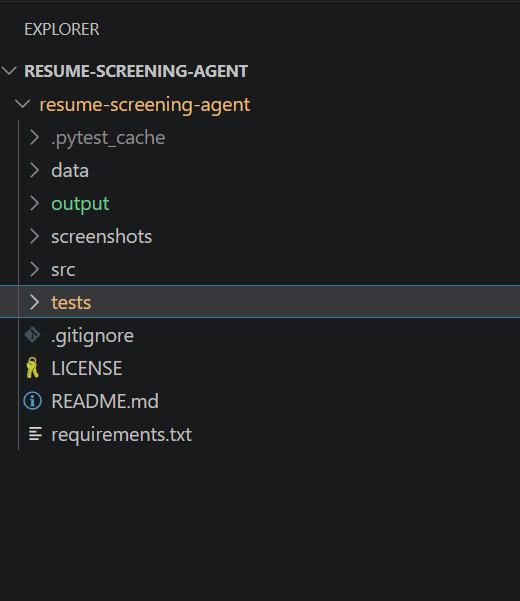
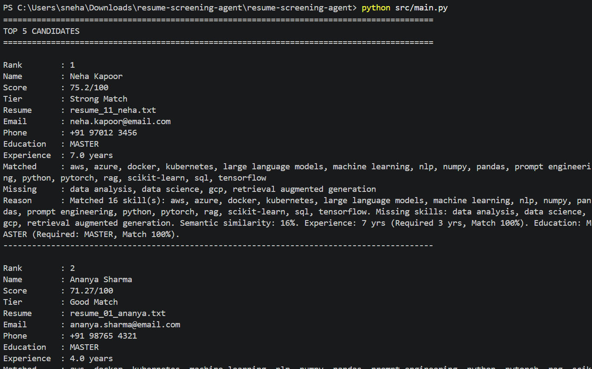
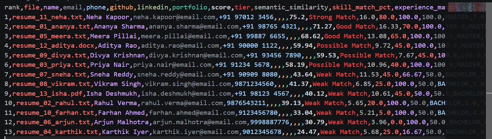
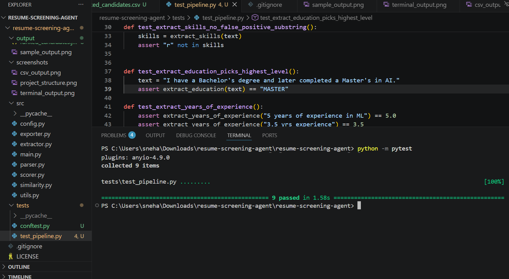

# Resume Screening Agent

A Python-based AI Resume Screening Agent that automatically ranks resumes against a job description using semantic similarity, skill matching, education, and experience.

Developed for the **Rooman Technologies 24-Hour AI Agent Challenge (Junior AI Research Associate Selection Round).**

---

## Project Overview

This agent accepts:

- A Job Description (JD)
- A Folder of Resumes (PDF, DOCX, TXT)

and automatically:

- Parses resumes
- Extracts candidate information
- Matches skills against the JD
- Calculates semantic similarity
- Scores every candidate
- Ranks candidates
- Exports results to CSV and JSON

The entire pipeline runs **offline** without requiring any API keys or internet connection.

---

## Features

- Supports PDF, DOCX, and TXT resumes
- Automatic extraction of:
  - Name
  - Email
  - Phone Number
  - Skills
  - Education
  - Years of Experience
- TF-IDF + Cosine Similarity for semantic matching
- Weighted scoring system
- Candidate ranking
- Human-readable reasoning
- CSV and JSON export
- Unit tested using Pytest

---

# Project Workflow

```
                 Job Description
                        │
                        ▼
               Extract JD Requirements
                        │
                        ▼
              Parse Candidate Resumes
                        │
                        ▼
      Extract Skills, Education, Experience
                        │
                        ▼
          Semantic Similarity (TF-IDF)
                        │
                        ▼
          Weighted Candidate Scoring
                        │
                        ▼
               Candidate Ranking
                        │
             ┌──────────┴──────────┐
             ▼                     ▼
        CSV Report            JSON Report
```

---

# Project Structure

```
resume-screening-agent/
│
├── src/
│   ├── main.py
│   ├── parser.py
│   ├── extractor.py
│   ├── scorer.py
│   ├── similarity.py
│   ├── exporter.py
│   ├── utils.py
│   └── config.py
│
├── data/
│   ├── job_description/
│   └── resumes/
│
├── output/
│   ├── ranked_candidates.csv
│   └── ranked_candidates.json
│
├── screenshots/
│   ├── project_structure.png
│   ├── terminal_output.png
│   ├── csv_output.png
│   └── pytest_output.png
│
├── tests/
│   ├── conftest.py
│   └── test_pipeline.py
│
├── requirements.txt
├── README.md
├── LICENSE
└── .gitignore
```

---

# Technologies Used

- Python 3
- Scikit-learn
- Pandas
- NumPy
- pdfplumber
- python-docx
- Pytest

---

# Installation

Clone the repository

```bash
git clone https://github.com/Sneha27-dev/resume-screening-agent.git
```

Move into the project

```bash
cd resume-screening-agent
```

Install dependencies

```bash
pip install -r requirements.txt
```

---

# Running the Project

Execute

```bash
python src/main.py
```

The application automatically:

- Loads the sample Job Description
- Reads all resumes
- Extracts candidate information
- Scores candidates
- Displays Top Candidates
- Creates

```
output/
    ranked_candidates.csv
    ranked_candidates.json
```

---

# Running Unit Tests

Run

```bash
python -m pytest tests/ -v
```

The project contains **9 unit tests** covering:

- Skill extraction
- Negation handling
- Education extraction
- Experience extraction
- Email extraction
- Phone extraction
- Candidate profile creation
- Candidate scoring
- Ranking logic

---

# Sample Output

Top Ranked Candidates

```
TOP 5 CANDIDATES

Rank 1
Name : Neha Kapoor
Score : 75.20
Tier : Strong Match

Rank 2
Name : Ananya Sharma
Score : 71.27
Tier : Good Match

Rank 3
Name : Meera Pillai
Score : 68.62
Tier : Good Match

Rank 4
Name : Aditya Rao
Score : 59.94
Tier : Possible Match

Rank 5
Name : Divya Krishnan
Score : 59.53
Tier : Possible Match
```

---

# Sample JSON Output

```json
{
  "rank": 1,
  "file": "resume_11_neha.txt",
  "name": "Neha Kapoor",
  "score": 75.2,
  "tier": "Strong Match",
  "semantic_similarity": 16.0,
  "skill_match_pct": 80.0,
  "experience_match_pct": 100.0,
  "education_match_pct": 100.0
}
```

---

# Screenshots

## Project Structure



---

## Terminal Output



---

## CSV Output



---

## Pytest Output



---

# Scoring Method

Candidate scores are calculated using a weighted combination of:

| Component | Weight |
|-----------|--------|
| Semantic Similarity | 45% |
| Skill Match | 35% |
| Experience Match | 20% |

The agent also evaluates:

- Education Match
- Required Skills
- Missing Skills
- Candidate Experience

Finally, each candidate is categorized as:

- Strong Match
- Good Match
- Possible Match
- Weak Match

---

# Design Decisions

Instead of using an online LLM API, this project uses a fully offline approach.

Advantages:

- No API key required
- Fully reproducible
- Faster execution
- Explainable scoring
- Deterministic results
- Easy to test

Current semantic matching uses:

- TF-IDF Vectorization
- Cosine Similarity

---

# Future Improvements

With additional development time, the following enhancements could be added:

- Sentence Transformers embeddings
- OpenAI / Anthropic LLM integration
- OCR support for scanned PDFs
- Date-based experience calculation
- Section-aware resume parsing
- Configurable scoring weights
- Recruiter-style AI-generated candidate summaries

---

# How to Reproduce

```bash
git clone https://github.com/Sneha27-dev/resume-screening-agent.git

cd resume-screening-agent

pip install -r requirements.txt

python src/main.py
```

---

# License

This project is released under the MIT License.

---

# Author

**Sneha**

GitHub:
https://github.com/Sneha27-dev
